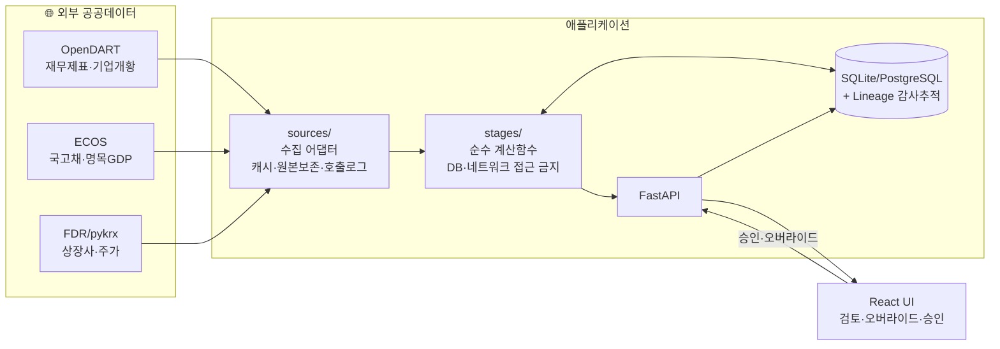
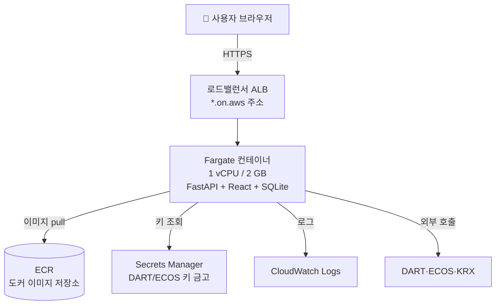

# Valuation App — 기업가치평가 자동화·감사추적 플랫폼

[](https://github.com/Chris-mk98/valuation-app/actions/workflows/ci.yml)

한국 상장·비상장 기업의 가치를 **DART·ECOS·KRX 공공데이터**로 자동 산출하되,
"자동 계산기"가 아니라 **평가 전문가의 판단을 구조화하고 모든 숫자의 출처를 기록**하는 내부 도구.

수익가치(DCF)·시장가치(멀티플)·자산가치를 산출하고, 몬테카를로로 분포를 추정한 뒤,
평가목적별(손상검사·합병비율·상증세법·일반 M&A) 규제 제약으로 종합한다.

> **🌐 라이브 데모:** https://va-5456fafc704043908262540477e9856a.ecs.ap-northeast-2.on.aws
> (삼성전자 `005930`, 세원물산 `024830` 등으로 케이스를 만들어 보세요)

---

## 목차
1. [무엇을 하는가](#무엇을-하는가)
2. [데이터는 어떻게 흐르는가](#데이터는-어떻게-흐르는가) ← 핵심
3. [10단계 파이프라인](#10단계-파이프라인)
4. [핵심 기능](#핵심-기능)
5. [로컬 실행](#로컬-실행)
6. [배포 환경 — AWS를 모르는 사람도](#배포-환경--aws를-모르는-사람도)
7. [코드 수정·운영 배포 전략](#코드-수정운영-배포-전략)
8. [TO-DO / 로드맵](#to-do--로드맵)
9. [기술 스택·테스트·환경변수](#기술-스택테스트환경변수)

---

## 무엇을 하는가

회계법인 가치평가팀은 매번 같은 일을 반복한다 — DART에서 재무제표를 받아 엑셀에 옮기고,
유사기업을 골라 배수를 구하고, WACC·DCF를 계산하고, 목적에 맞게 종합한다.
이 앱은 그 흐름을 자동화하되, **네 가지 원칙을 절대 어기지 않는다**:

| 원칙 | 의미 |
|---|---|
| **① 검토 체크포인트** | 모든 단계는 `자동산출 → 사람이 검토 → 승인` 후에만 다음으로. 상위를 고치면 하위는 자동 무효화 |
| **② 전문가 오버라이드** | 시스템이 채운 값은 **사유를 적어야** 덮어쓸 수 있고, 원본은 절대 안 지운다 |
| **③ Excel 왕복** | 입력 표는 템플릿 다운로드+업로드, 모든 단계 결과는 다운로드 |
| **④ Lineage(감사추적)** | 어떤 숫자도 출처(`API·파라미터표·파생·전문가입력·엑셀` 중 하나) 없이 저장하지 않는다 |

---

## 데이터는 어떻게 흐르는가

실제 데이터 한 건이 **외부 API에서 최종 가치까지** 흘러가는 경로:



**핵심 규칙 (코드로 강제됨):**
- **외부 호출은 `sources/`에서만.** 호출 전 캐시 확인 → 호출 후 원본 그대로 저장 + `api_call_log` 기록. 원본(🌐)은 절대 수정 안 함.
- **`stages/*`는 순수 함수.** DataFrame/dict를 받아 dict를 반환. DB·HTTP 접근 금지 → 손계산 기대값으로 테스트 가능.
- **모든 파생값은 `lineage`에 출처와 함께 기록.** 전문가가 덮어쓰면 `EXPERT_OVERRIDE`로 사유·원값·작성자까지 남는다.

**실제 예시 — 삼성전자(연결재무 제출) vs 세원물산(별도만 제출):**
```
DART 수집    → 삼성: 연결(CFS) 176~210계정 / 세원물산: 연결없음→별도(OFS) 134~140계정 자동폴백
정규화       → DART 표준계정 → 내부계정(매출·EBIT·D&A·순차입금…). 손익은 IS·CIS 어디든 매칭
유사기업     → KRX 업종 → DART KSIC 중분류 확정 → 규모·흑자·상장연수 필터
WACC         → 국고채 Rf + 유사기업 주간베타 → CAPM Ke → WACC
DCF·시장·자산 → 3가지 방법으로 가치 산출
몬테카를로   → 6변수 분포 10,000회 재계산 → P10/50/90
종합         → 목적별 가중(손상/합병/상증세/일반) + 레드플래그 승인 → 최종 가치
산출물       → 풋볼필드·리포트·워크북·감사추적 CSV·케이스 JSON
```

---

## 10단계 파이프라인

| Stage | 하는 일 | 순수 계산함수 |
|---|---|---|
| **0 설정** | 대상회사·기준일·평가목적 입력 → corp_code 매핑 | — |
| **1 수집** | DART 재무 5개년·기업개황, ECOS 국고채, KRX 주가 (캐시·원본보존) | — |
| **2 정규화** | DART 표준계정 → 내부계정 매핑 (연결/별도·IS/CIS 모두 대응) | `s2_normalize` |
| **3 유사기업** | KRX 업종 프리필터 → DART KSIC 중분류 → 규모·흑자·상장연수 필터 | `s3_peers` |
| **4 WACC** | 유사기업 주간 β OLS → 언레버/리레버 → CAPM Ke → Kd → WACC | `s4_wacc` |
| **5 DCF** | 예측가정 → FCFF → 현가+터미널밸류 → EV → 주주가치 | `s5_dcf` |
| **6 시장접근** | EV/EBITDA·PER·PBR → 이상치 제거·중앙값 → 대상 적용 | `s6_market` |
| **7 자산접근** | 지배주주 순자산 ± 조정항목 (상증세법 할증) | `s7_asset` |
| **8 몬테카를로** | 6변수 정규분포·상관 → 10,000회 DCF → 분포·토네이도 | `s8_montecarlo` |
| **9 목적별 종합** | 방법론 가중(목적별 잠금)·명목GDP·레드플래그 승인 | `s9_review` |
| **10 산출물** | 풋볼필드·HTML 리포트·전체 워크북·감사추적·케이스 JSON | — |

각 단계는 **검토 화면 → 승인** 후에만 다음으로 진행되며(HITL), 상위 단계를 다시 실행하면 하위 승인이 자동 무효화된다.

---

## 핵심 기능

- **평가목적별 규제 제약을 규칙(YAML)으로 강제** — 손상검사(사용가치/공정가치 병렬), 합병비율(수익:자산 **1.5:1 가중치 잠금**), 상증세법(순손익:순자산 **3:2 + 순자산 80% 하한 + 최대주주 할증**), 일반 M&A(사용자 가중)
- **레드플래그 승인 게이트** — TV비중>70%·영구성장률>명목GDP·예측마진>과거최고·CAPEX<D&A·유사기업<5·베타 R²<0.1. 발동된 플래그를 **승인해야만** 다음으로 진행되며 승인 내역이 기록됨
- **결손 데이터를 숨기지 않음** — D&A 미상, 유사기업 부족 등을 경고로 노출하고 오버라이드를 유도
- **전 단계 Excel 왕복** — 계정 매핑표·예측가정·거래사례·자산조정 템플릿 업/다운로드
- **몬테카를로 시각화** — 히스토그램·토네이도(recharts)
- **완전한 감사추적** — 모든 값의 출처, 오버라이드 사유·원값·작성자를 CSV/JSON으로 내보내기

---

## 로컬 실행

```bash
# 백엔드 (계산·API)
cd backend
pip install -e ".[dev]"                 # 외부수집까지: pip install -e ".[dev,sources]"
uvicorn app.main:app --reload           # http://localhost:8000/health · /docs
pytest                                   # 127건, 네트워크 없이 통과

# 프론트엔드
cd frontend
npm install
npm run dev                              # http://localhost:5173
```

`.env`에 `DART_API_KEY`·`ECOS_API_KEY`를 넣으면 실제 수집이 동작한다(키 없어도 앱은 기동).

---

## 배포 환경 — AWS를 모르는 사람도

이 앱은 **하나의 컨테이너**(FastAPI가 API와 프론트엔드 정적 파일을 같이 서빙)로 AWS에 떠 있다.
App Runner가 2026-04-30 신규 중단되어 그 후속인 **Amazon ECS Express Mode**를 사용한다.

### 배포 아키텍처 (실제 라이브 구조)



### 용어 쉽게

| AWS 용어 | 쉬운 설명 |
|---|---|
| **컨테이너 / 도커 이미지** | 앱을 실행에 필요한 모든 것과 함께 통째로 담은 "실행 패키지" |
| **ECR** | 그 도커 이미지를 올려두는 AWS의 창고 (사진첩 같은 것) |
| **ECS Express Mode / Fargate** | 서버를 직접 사고 관리하지 않고 "컨테이너만 올리면" AWS가 알아서 돌려주는 방식 |
| **ALB (로드밸런서)** | 인터넷에서 온 요청을 앱 컨테이너로 전달하는 안내 데스크. HTTPS 주소를 자동 제공 |
| **Secrets Manager** | API 키 같은 비밀을 코드·이미지에 넣지 않고 안전하게 보관하는 금고 |
| **IAM 역할** | "이 서비스는 이 일(ECR에서 이미지 받기, 금고에서 키 읽기)을 해도 된다"는 권한 명찰 |
| **CloudWatch Logs** | 앱이 찍는 로그를 모아 보는 곳 (디버깅용) |

### 지금 무엇이 어디에 있나
- **이미지**: ECR `valuation-app:latest` (ap-northeast-2 서울 리전)
- **서비스**: ECS Express Gateway Service `valuation-app` (클러스터 `valuation`)
- **키**: Secrets Manager `valuation/dart-api-key`, `valuation/ecos-api-key` (평문 아님, 실행역할만 읽음)
- **역할**: `ecsTaskExecutionRole`(이미지·키·로그), `ecsInfraExpressRole`(ALB·오토스케일 관리)
- **데이터**: 컨테이너 내부 SQLite → ⚠️ **컨테이너 재시작 시 초기화됨**(영속 필요 시 RDS 연결, [TODO](#to-do--로드맵))

### 비용
ALB + Fargate 상시 1태스크 ≈ **월 $40~55**. 안 쓸 때 서비스 삭제로 과금 중단:
```bash
aws ecs delete-express-gateway-service \
  --service-arn arn:aws:ecs:ap-northeast-2:082139775785:service/valuation/valuation-app \
  --region ap-northeast-2 --profile valuation
```

---

## 코드 수정·운영 배포 전략

### 개발 흐름
```
코드 수정 → pytest·ruff 로컬 통과 → git push
         → GitHub Actions CI(ruff+pytest+build) 자동 검증
```

### 배포 흐름 (수동 트리거)
```
GitHub Actions → "Deploy (App Runner)" 워크플로 Run
   → GitHub 러너가 결합 이미지 빌드(node 프론트 + python 백엔드)
   → ECR에 :latest 푸시
   → (아래 주의) 새 digest로 ECS 서비스 재배포
```

> **⚠️ 중요 주의 — `:latest`만으론 자동 재배포 안 됨**
> ECS Express는 App Runner와 달리 ECR `:latest` 재푸시를 자동 감지하지 않는다.
> 워크플로가 이미지를 푸시한 뒤, **새 이미지 digest로 서비스를 업데이트**해야 실제 반영된다:
> ```bash
> DIGEST=$(aws ecr describe-images --repository-name valuation-app \
>   --image-ids imageTag=latest --region ap-northeast-2 --profile valuation \
>   --query 'imageDetails[0].imageDigest' --output text)
> # infra/deploy/update.json 의 image를 valuation-app@$DIGEST 로 바꿔
> aws ecs update-express-gateway-service --cli-input-json file://update.json \
>   --region ap-northeast-2 --profile valuation
> ```
> (이 digest 재배포 자동화는 [TODO](#to-do--로드맵) 항목)

### 롤아웃·롤백 주의
- ECS Express는 배포 실패 시 **CloudWatch 알람 기반으로 자동 롤백**한다.
- **초기 배포 직후 재배포하면** 알람이 아직 안정화 전이라 "active alarm"으로 즉시 롤백될 수 있다 → 알람이 OK로 안정된 뒤 재배포.
- 배포 상태 확인: `aws ecs describe-service-deployments --service-deployment-arns <arn> --query 'serviceDeployments[0].status'` (`IN_PROGRESS→SUCCESSFUL` 정상, `ROLLBACK_*`은 실패)

### 배포 전 체크리스트
- [ ] `pytest` 127건 통과, `ruff check` 통과
- [ ] `frontend` `npm run build` 성공
- [ ] 이미지에 `.env` 미포함 확인 (루트 `.dockerignore`가 제외)
- [ ] 키 변경 시 Secrets Manager만 갱신(이미지 재빌드 불필요)

---

## TO-DO / 로드맵

### 운영·안정화 (우선)
- [ ] **데이터 영속화** — SQLite→PostgreSQL(RDS). 현재 컨테이너 재시작 시 케이스 소실. `DATABASE_URL`만 바꾸면 됨
- [ ] **배포 자동화** — Deploy 워크플로가 digest 재배포까지 수행(현재 수동), 또는 이미지 태그를 커밋 SHA로
- [ ] **케이스 관리 기능** — 케이스 목록·삭제 API/화면 (현재 삭제 수단 없음)
- [ ] **인증/권한** — 팀 멀티유저(현재 무인증 단일 사용자)

### UI/UX 개선
- [ ] 전반적 UI/UX 리디자인 — 단계 네비게이션·검토 화면 가독성·오류 메시지·로딩 상태
- [ ] 풋볼필드·몬테카를로 차트 인터랙션 강화, 반응형
- [ ] 케이스 대시보드(목록·진행상태·최근 작업)

### 기능 확장
- [ ] 거래사례(M&A 배수) DART 주요사항보고서 파싱 자동구축 (현재 엑셀 업로드만)
- [ ] DCF 예측가정 연도별 세분화, 몬테카를로 상관행렬 사용자 입력
- [ ] 수식 살아있는 최종 워크북, PDF 리포트(CJK 폰트 임베딩)
- [ ] Stage 3~4 유사기업 캐시 인덱스로 DART 호출 추가 절감

---

## 기술 스택·테스트·환경변수

**스택:** Python 3.12 · FastAPI · SQLAlchemy 2.0 · pandas/numpy/scipy · openpyxl ·
React 18 · TypeScript · Vite · Tailwind · recharts ·
데이터: OpenDART · ECOS · FinanceDataReader/pykrx · 다모다란(ERP·베타)

**아키텍처:**
```
backend/  core/(lineage·stage_gate·rules) · sources/ · stages/ · params/ · excel/ · reports/ · api/
frontend/ src/pages(Stage별 화면) · components · api
infra/    docker-compose · deploy/(Dockerfile·배포 스크립트·가이드)
data/     정적 파라미터(CSV·YAML) + SQLite 캐시(gitignore)
```

**테스트:** `cd backend && pytest` — **127건, 네트워크 불필요**. 계산 로직은 손계산 기대값 대조,
외부 API는 VCR 카세트(키 스크럽) 재생, 몬테카를로는 seed 고정 재현성.
CI(GitHub Actions): ruff lint + pytest(backend) · vite build(frontend).

**환경변수** (`.env`, 커밋 금지 — [`.env.example`](.env.example) 참고):
- `DART_API_KEY` · `ECOS_API_KEY` — 없어도 앱은 기동(수집만 제한)
- `DATABASE_URL` — 기본 SQLite, 배포 시 PostgreSQL 지정 가능
- `DATA_DIR` · `FRONTEND_DIST` — 배포 이미지에서 경로 오버라이드용

전체 설계: [`docs/data_flow.md`](docs/data_flow.md) · 개발 로그: [`docs/ai_dev_log.md`](docs/ai_dev_log.md) · 프로젝트 규칙: [`CLAUDE.md`](CLAUDE.md)
