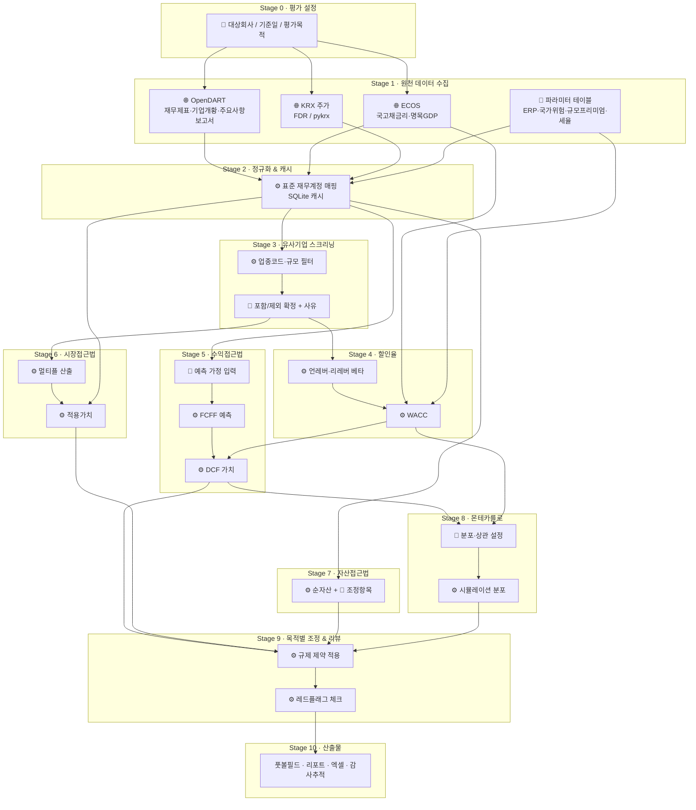

# 기업가치평가 웹앱 — 데이터 입력·흐름·산출물 설계서

> 목적: 각 데이터가 **어디서 오는지(사용자 입력 / API 호출 / 정적 테이블)**, **어떤 순서로 가공되는지**, **최종적으로 무엇이 나오는지**를 한 장으로 추적할 수 있게 정리한 문서.
> 표기: 🧑 사용자 입력 · 🌐 API 자동 수집 · 📄 정적 파라미터 테이블(수동 갱신) · ⚙️ 시스템 산출값

---

## 0. 횡단 설계 원칙 (모든 Stage에 적용)

앱은 "자동 계산기"가 아니라 **"전문가의 판단을 구조화·기록하는 도구"** 다. 아래 세 원칙은 모든 단계에 예외 없이 적용한다.

### 원칙 A · 검토 체크포인트 (Human-in-the-loop)
- 각 Stage는 **자동 산출 → 사용자 검토 화면 → 승인** 의 3단계로만 다음 Stage로 넘어간다. 승인 전에는 후속 Stage 계산이 잠긴다.
- 검토 화면은 반드시 다음을 보여준다: 산출값, 산출 근거(입력값·산식·출처), 시스템 경고, 이전 승인 대비 변경분.
- 승인 상태는 `stage_status` 테이블에 기록 (DRAFT → REVIEWED → APPROVED, 승인자·시각). 상위 Stage 입력이 바뀌면 하위 Stage는 자동으로 DRAFT로 되돌린다.
- 대시보드에 Stage별 진행·승인 현황 스테퍼를 항상 표시한다.

### 원칙 B · 전문가 판단 오버라이드 (Expert Override)
- 시스템이 채우는 모든 값(⚙️ 산출값, 📄 기본값, 🌐 API 값의 파생치)은 사용자가 **덮어쓸 수 있다.** 단 🌐 원본 데이터 자체는 수정 불가(원본 보존), 파생 단계에서만 덮어쓴다.
- 덮어쓸 때는 **사유 입력이 필수**이며, lineage에 `source_type = EXPERT_OVERRIDE`, 시스템 제안값(`system_value`), 사용자값(`value`), 사유(`rationale`)를 함께 저장한다.
- 오버라이드된 셀은 UI에서 시각적으로 구분(색상 + 아이콘)하고, 리포트 부록에 "전문가 판단 적용 내역" 표로 자동 집계한다.
- 목적별 규제 제약(Stage 9)에 걸리는 값은 오버라이드를 허용하되 **경고를 승인해야만** 진행되며, 이 승인도 기록한다.
- 시스템 제안값으로 되돌리기(reset) 버튼을 항상 제공한다.

### 원칙 C · Excel 업로드/다운로드 전면 지원
- **다운로드**: 모든 Stage의 검토 화면에서 해당 Stage 데이터를 엑셀로 내보낼 수 있다. 최종 워크북은 수식이 살아있는 형태로 생성한다.
- **업로드**: 사용자 입력이 필요한 모든 표(예측 가정, 유사기업 확정, 조정항목, 분포 설정, 비상장사 재무제표, 주가 폴백)는 **앱이 제공하는 템플릿 엑셀**을 내려받아 채운 뒤 업로드하는 경로를 병행 지원한다.
- 업로드 시 검증(필수 컬럼, 자료형, 범위)을 거치고, 오류는 셀 단위로 표시한다. 업로드 값은 lineage에 `source_type = EXCEL_UPLOAD` + 파일명·해시·업로드 시각으로 기록한다.
- 라운드트립 보장: 다운로드한 파일을 수정 후 그대로 업로드하면 동일 구조로 반영된다.

### Stage별 적용 매트릭스

| Stage   | 검토 체크포인트에서 보는 것          | 오버라이드 가능 항목                         | Excel 업로드                | Excel 다운로드                         |
| ------- | ------------------------ | ----------------------------------- | ------------------------ | ---------------------------------- |
| 1 수집    | API 조회 결과·조회일·실패 내역      | (원본 수정 불가)                          | 주가 폴백 CSV, 비상장사 재무제표 템플릿 | 원본 재무 덤프                           |
| 2 정규화   | 표준계정 매핑표, 미분류 계정         | 계정 매핑                               | 매핑표                      | 정규화 재무                             |
| 3 유사기업  | 후보·필터 통과 여부              | 포함/제외, 수동 추가                        | 유사기업 확정 템플릿              | 후보 리스트                             |
| 4 WACC  | 구성요소별 값·출처·베타 회귀 통계      | 모든 구성요소(Rf, β, ERP, 프리미엄, Kd, 자본구조) | WACC 템플릿                 | WACC 빌드업                           |
| 5 DCF   | 과거 vs 예측 추세 차트, FCFF 테이블 | 연도별 가정, 영구성장률, TV 방식                | 예측 가정 템플릿                | DCF 시트(수식 포함)                      |
| 6 시장접근  | 멀티플 테이블·이상치 제거 결과        | 이상치 처리, 적용 멀티플, 거래사례 추가             | 거래사례 템플릿                 | 멀티플 테이블                            |
| 7 자산접근  | 순자산 조정 내역                | 조정항목                                | 조정항목 템플릿                 | 조정 순자산                             |
| 8 몬테카를로 | 분포 파라미터·상관행렬·결과 분포       | 분포·상관                               | 분포 설정 템플릿                | 시뮬레이션 결과                           |
| 9 조정·리뷰 | 방법론별 가치, 가중치, 레드플래그      | 가중치(목적별 허용 범위 내), 플래그 승인            | —                        | 최종 요약                              |
| 10 산출물  | 리포트 미리보기                 | —                                   | —                        | PDF, 전체 워크북, lineage CSV, 케이스 JSON |

---

## 1. 전체 흐름 한눈에 보기



---

## 2. 데이터 소스 카탈로그

| 소스 | 제공 데이터 | 접근 방식 | 비용 | 갱신 주기 | 캐시 정책 |
|---|---|---|---|---|---|
| OpenDART (금감원) | 사업·분기보고서 재무제표(XBRL 표준계정), 기업개황(업종코드, 상장여부), 주요사항보고서(합병·영업양수도) | REST API, 개인 인증키 | 무료 (일일 호출 한도 있음) | 공시 시 | 회사·연도·보고서코드 단위로 SQLite 저장, 재호출 금지 |
| ECOS (한국은행) | 국고채 수익률(1~30Y, 일별), 명목 GDP 성장률, CPI | REST API, 개인 인증키(발급 최대 1일) | 무료 | 일/분기 | 기준일 단위 캐시 |
| KRX 주가 (FinanceDataReader / pykrx) | 일별 종가·시가총액·상장주식수 | 라이브러리(스크래핑) | 무료 | 일 | 종목·기간 단위 캐시. 차단 시 CSV 수동 업로드 폴백 |
| 다모다란 공개 데이터셋 | ERP, 국가위험프리미엄, 업종 언레버 베타, 업종 EV/EBITDA | CSV 다운로드 → 📄 테이블 적재 | 무료 | 연 1회 | 버전·다운로드일 기록 |
| 📄 내부 파라미터 테이블 | 규모프리미엄, 법인세율, 비유동성 할인율, 평가목적별 규제 제약 | 관리자 화면에서 수정 | — | 수동 | 변경 이력(누가·언제·이전값) 기록 |
| 🧑 사용자 | 아래 3장 참조 | 웹 폼 / 엑셀 업로드 | — | — | 평가 케이스 단위 저장 |

> 유료 소스(CapIQ·Bloomberg·Kroll) 대체: 거래사례는 DART 주요사항보고서 파싱으로 자체 구축, 프리미엄류는 다모다란 + 수동입력 필드.

---

## 3. 입력값 상세 정의

### 3-1. 🧑 사용자 입력 (필수)

| 필드 | 형식 | 검증 규칙 | 사용처 |
|---|---|---|---|
| 대상회사 | 회사명 or 종목코드 → DART corp_code 매핑 | DART 기업개황 존재 확인 | 전 단계 |
| 평가기준일 | 날짜 | 미래 불가, 최근 재무제표 존재 | 주가·금리 조회 기준 |
| 평가목적 | 선택: `손상검사(K-IFRS 1036)` / `합병비율(자본시장법)` / `상증세법 보충적평가` / `일반 M&A` | — | Stage 9 제약 세트 결정 |
| 통화·단위 | KRW, 백만원 | — | 표시 |

### 3-2. 🧑 사용자 입력 (예측 가정 — 기본값은 ⚙️ 과거 3~5년 평균으로 자동 채움, 사용자가 덮어쓰기)

| 필드 | 기본값 산출 방식 | 사용자 편집 | 검증/경고 |
|---|---|---|---|
| 예측기간(년) | 5 | 가능 | 손상검사 목적 시 5년 초과 경고 |
| 매출성장률(연도별) | 과거 CAGR | 가능 | 명목GDP 대비 과도 시 경고 |
| 영업이익률(연도별) | 과거 평균 | 가능 | 과거 최고치 초과 시 레드플래그 |
| CAPEX / 매출 | 과거 평균 | 가능 | 감가상각 대비 지속 하회 시 경고 |
| 운전자본 / 매출 | 과거 평균 | 가능 | — |
| 영구성장률 | 명목GDP 장기 or 1~2% | 가능 | 명목GDP 초과 시 레드플래그 |
| 법인세율 | 📄 테이블 | 가능 | — |

### 3-3. 🧑 사용자 입력 (선택·조정 항목)

| 필드 | 설명 |
|---|---|
| 유사기업 포함/제외 확정 + 사유 | Stage 3 자동 후보군에 대해 체크박스 + 사유 텍스트 (필수 기록) |
| 비영업자산·부채 조정 | 투자부동산, 소송충당부채 등 순자산 조정 |
| 비유동성 할인 / 지배권 프리미엄 | %, 📄 기본값 제공 |
| 몬테카를로 분포 설정 | 변수별 분포 유형·파라미터, 변수 간 상관계수 행렬 |
| 방법론 가중치 | DCF / 시장접근 / 자산접근 비율 (목적별 고정값이면 편집 잠금) |
| 폴백 CSV 업로드 | 주가 스크래핑 실패 시 |

### 3-4. 🌐 API 자동 수집 (사용자 편집 불가, 원본 보존)

| 데이터 | 소스 | 호출 파라미터 | 저장 형태 |
|---|---|---|---|
| 재무상태표·손익계산서·현금흐름표 (최근 5개년 + 최신 분기) | DART `fnlttSinglAcntAll` | corp_code, bsns_year, reprt_code, fs_div | 원본 JSON + 표준계정 매핑 테이블 |
| 기업개황 (업종코드·상장시장·결산월) | DART `company` | corp_code | 테이블 |
| 유사기업 후보 재무 | DART (다중 호출) | 후보 corp_code 리스트 | 동일 |
| 거래사례 (합병·영업양수도) | DART 주요사항보고서 검색 + 본문 파싱 | 업종·기간 | 거래사례 테이블 (거래가액, 대상 EBITDA, 배수) |
| 국고채 수익률 | ECOS 817Y002 | 기준일, 만기(10Y 기본) | 테이블 |
| 명목 GDP 성장률 | ECOS | 최근 10년 | 테이블 |
| 유사기업·대상회사 일별 주가 | FDR/pykrx | 종목코드, 기준일 -2~5년 | 테이블 |
| 시가총액·상장주식수 | FDR/pykrx | 종목코드, 기준일 | 테이블 |

### 3-5. 📄 정적 파라미터 테이블

| 파라미터 | 출처 | 갱신 |
|---|---|---|
| 시장위험프리미엄(ERP) | 다모다란 | 연 1회 |
| 국가위험프리미엄 | 다모다란 | 연 1회 |
| 업종 언레버 베타 (보조) | 다모다란 | 연 1회 |
| 규모프리미엄 | 수동 (실무 배포 시 Kroll 대체) | 수동 |
| 법인세율 | 관리자 | 세법 개정 시 |
| 평가목적별 제약 규칙 | 관리자 | 규정 개정 시 |

---

## 4. 단계별 흐름 (입력 → 처리 → 출력)

### Stage 0 · 평가 설정
- **입력**: 🧑 회사, 기준일, 목적
- **처리**: DART corp_code 매핑, 케이스 ID 생성, 목적별 제약 규칙 세트 로드
- **출력**: `case` 레코드 (case_id, 기준일, 목적, 제약세트 버전)

### Stage 1 · 원천 데이터 수집
- **입력**: `case` + 🌐 API 키
- **처리**: 캐시 조회 → 미존재 시 API 호출 → 원본 저장 → 호출 로그(시각, 엔드포인트, 응답코드)
- **출력**: 원본 JSON/CSV, `data_lineage` 레코드 (출처 URL, 조회일시, 파라미터)
- **실패 처리**: 주가 조회 실패 → 사용자 CSV 업로드 폴백 (lineage에 `manual_upload` 표기)

### Stage 2 · 정규화 & 캐시
- **입력**: 원본 재무제표
- **처리**: DART 표준계정(XBRL) → 앱 내부 계정체계 매핑 (매출, EBIT, D&A, CAPEX, 순운전자본, 순차입금, 비지배지분 등). 매핑 불가 계정은 "미분류" 목록으로 사용자에게 노출
- **출력**: `financials_normalized` (회사 × 연도 × 계정)

### Stage 3 · 유사기업 스크리닝
- **입력**: 대상회사 업종코드, 규모(매출·시총), 📄 필터 기준
- **처리**: DART 전체 상장사 중 동일 KSIC 중분류 → 매출 0.2~5배 → 흑자여부 → 상장 2년 이상 → 후보 10~20개 자동 추출
- **출력**: 후보 리스트 + 각 필터 통과/탈락 사유 → 🧑 사용자가 최종 확정 (사유 필수)
- **기록**: 제외 사유는 감사추적에 그대로 남음

### Stage 4 · 할인율(WACC)
| 구성요소 | 데이터 출처 | 산식 |
|---|---|---|
| 무위험이자율 Rf | 🌐 ECOS 국고채 10Y (기준일) | 그대로 |
| 유사기업 레버 베타 | 🌐 주가 (주간수익률 2~5년) vs KOSPI 회귀 | OLS 기울기 |
| 언레버 베타 | ⚙️ + 🌐 각사 순차입금/시총 + 📄 세율 | β_u = β_L / (1 + (1−t)·D/E) |
| 대상회사 리레버 베타 | ⚙️ 유사기업 언레버 베타 중앙값 + 🧑 목표 자본구조 | β_L = β_u · (1 + (1−t)·D/E) |
| ERP, 국가위험, 규모프리미엄 | 📄 테이블 | 가산 |
| 타인자본비용 Kd | 🧑 입력 or ⚙️ 이자비용/평균차입금 | — |
| **WACC** | ⚙️ | E/V·Ke + D/V·Kd·(1−t) |

- **출력**: `wacc_build` 레코드 — 각 구성요소 값 + 출처 + 조회일

### Stage 5 · 수익접근법 (DCF, FCFF)
- **입력**: `financials_normalized`(과거), 🧑 예측 가정, ⚙️ WACC, 🧑/⚙️ 영구성장률
- **처리**: 연도별 FCFF = EBIT(1−t) + D&A − CAPEX − ΔNWC → 현가 → 터미널밸류(고든 or Exit 멀티플) → 기업가치 → 순차입금·비영업자산 조정 → 주주가치
- **출력**: `dcf_result` (연도별 FCFF, 현가, TV, TV 비중, EV, 주주가치, 주당가치)

### Stage 6 · 시장접근법
- **입력**: 확정 유사기업, 🌐 시가총액·순차입금, `financials_normalized`(유사기업 LTM EBITDA·순이익·순자산), 거래사례 테이블
- **처리**: EV/EBITDA·PER·PBR 산출 → 이상치 제거(사분위) → 중앙값·평균 → 대상회사 LTM 지표에 적용. 거래사례 배수는 별도 트랙
- **출력**: `market_result` (멀티플 테이블, 적용가치 범위)

### Stage 7 · 자산접근법
- **입력**: 최신 재무상태표, 🧑 조정항목
- **처리**: 장부 순자산 ± 조정 → 조정순자산가치. 상증세법 목적 시 순자산가치 산식 별도 적용
- **출력**: `asset_result`

### Stage 8 · 몬테카를로 시뮬레이션
- **입력**: DCF 모델, 🧑 분포 설정(성장률·마진·WACC·영구성장률), 🧑 상관계수 행렬
- **처리**: 촐레스키 분해로 상관 반영 난수 생성 → N=10,000회 DCF 재계산 → 분포 통계
- **출력**: `mc_result` (평균·중앙값·P10/P50/P90, 히스토그램 데이터, 토네이도 민감도, 시나리오 확률가중치)

### Stage 9 · 목적별 조정 & 리뷰 체크
- **입력**: Stage 5~8 결과, 📄 목적별 제약 규칙
- **처리 (목적별)**:
  - 손상검사: 예측기간 ≤5년 강제, 영구성장률 상한, 사용가치 vs 공정가치 병렬 표시
  - 합병비율(자본시장법 시행령): 수익가치·자산가치 1.5:1 가중, 가중치 편집 잠금
  - 상증세법: 순손익가치·순자산가치 3:2, 최대주주 할증 규칙
  - 일반 M&A: 사용자 가중치
- **리뷰 체크(레드플래그)**: TV 비중 >70%, 영구성장률 > 명목GDP, 예측 마진 > 과거 최고치, CAPEX < D&A 지속, 유사기업 <5개, 베타 회귀 R² <0.1
- **출력**: `final_value` (방법론별 가치, 가중 최종 범위), `review_flags` (항목·심각도·근거값)

### Stage 10 · 산출물 생성
아래 5장 참조.

---

## 5. 최종 결과물

| 산출물 | 형식 | 내용 |
|---|---|---|
| 대시보드 화면 | 웹 | 풋볼필드 차트(방법론별 범위 겹침), 최종 가치 범위, 레드플래그 배지 |
| 평가 리포트 | PDF | 개요 → 회사·산업 → 방법론별 산출 → 몬테카를로 → 결론 → 부록(유사기업 선정사유, WACC 근거, 데이터 출처·조회일) |
| 계산 워크북 | Excel | 시트별: 원본재무 / 정규화 / 유사기업 / WACC / DCF / 멀티플 / 순자산 / MC 요약 — 수식 살아있는 형태 |
| 감사추적 로그 | 웹 화면 + CSV | 모든 입력값의 출처(🧑/🌐/📄), 값, 조회·입력 시각, 사용자, 변경 전후값 |
| 리뷰 체크리스트 | 웹 + PDF 부록 | 레드플래그 항목별 통과/경고/실패, 근거 수치 |
| 케이스 JSON | 다운로드 | 전체 입력·가정 스냅샷 (재현성 확보) |

---

## 6. 감사추적(Data Lineage) 스키마

모든 숫자에 다음 메타데이터를 붙인다.

```
lineage {
  case_id
  field_name          # 예: "risk_free_rate"
  value
  source_type         # USER | API | PARAM_TABLE | DERIVED | EXPERT_OVERRIDE | EXCEL_UPLOAD
  source_ref          # API 엔드포인트+파라미터 / 테이블명+버전 / 사용자ID / 파일명+해시
  retrieved_at        # API 조회 시각 또는 입력 시각
  derived_from[]      # DERIVED인 경우 상위 field_name 목록
  system_value        # EXPERT_OVERRIDE인 경우 시스템 제안값
  rationale           # EXPERT_OVERRIDE인 경우 필수 사유
  changed_by, prev_value, changed_at   # 사용자 덮어쓰기 이력
}

stage_status {
  case_id, stage_no
  status              # DRAFT | REVIEWED | APPROVED
  approved_by, approved_at
  invalidated_by      # 상위 Stage 변경으로 되돌려진 경우 원인 field_name
}
```

리포트 부록의 "데이터 출처" 표는 이 테이블에서 자동 생성한다.

---

## 7. 저장 구조 개요

| 테이블 | 키 | 비고 |
|---|---|---|
| `cases` | case_id | 평가 설정 |
| `raw_dart`, `raw_ecos`, `raw_price` | 소스별 자연키 | 원본 보존, 재사용 캐시 |
| `financials_normalized` | corp_code, year, account | |
| `peers` | case_id, corp_code | 포함여부, 사유 |
| `param_tables` | name, version | 변경 이력 포함 |
| `assumptions` | case_id, field | 사용자 가정 |
| `results_*` | case_id | 방법론별 결과 |
| `mc_runs` | case_id, run_id | 분포·통계 |
| `review_flags` | case_id | |
| `lineage` | case_id, field | 6장 |
| `api_call_log` | 시각 | 한도 관리 |

---

## 8. 알려진 한계와 대체 설계

| 한계 | 대체 |
|---|---|
| 거래사례 DB 유료 | DART 주요사항보고서 파싱으로 자체 구축, 표본 적음을 리포트에 명시 |
| 규모프리미엄 유료(Kroll) | 📄 수동 테이블 + 다모다란 참고값, 실무 배포 시 라이선스 데이터로 교체 가능한 구조 |
| KRX 스크래핑 불안정 | CSV 업로드 폴백, lineage에 표기 |
| DART 일일 호출 한도 | 캐시 우선, 호출 로그로 잔여 한도 모니터링 |
| 비상장 대상회사 | DART 미제출 시 🧑 재무제표 엑셀 업로드 경로 제공 |
